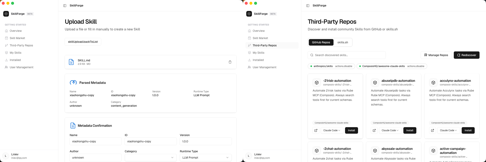

<div align="right"><a href="./README.md">中文</a> | English</div>

#  SkillForge

<p align="center">
  <strong>Enterprise Private AI Skill Management Platform</strong>
</p>

<p align="center">
  Deploy your own team/company skill marketplace to centrally manage, distribute, and install AI skills across Claude Code, Codex, Cursor, Gemini CLI, and other mainstream platforms.
</p>

<p align="center">
  
  
  
  
  
  
  
  
</p>

<p align="center">
  
  
  
  
  
  
  
  
</p>

<p align="center">
  
  
  
  
  
  
</p>



---

## 📌 Project Positioning

**SkillForge** is an enterprise-oriented **private AI skill management platform** (Private AI Skill Marketplace).

As AI coding assistants such as Claude Code, Codex, and Cursor become central to development workflows, teams accumulate large numbers of prompt templates, workflow scripts, and domain knowledge — but these skills are scattered across documents, codebases, or personal notes, making them hard to reuse and version.

### Core Pain Points & Solutions

| Pain Point | SkillForge Solution |
|------------|---------------------|
| Team skills are fragmented; newcomers struggle to ramp up | Unified skill marketplace for centralized management |
| Skill quality varies with no review mechanism | Draft / Stable dual-track release + evaluation criteria |
| External skill sources cannot be safely imported | Private marketplace + third-party repo discovery |
| Multi-platform IDE skills are not interoperable | Define once, install on multiple platforms |

---

## Core Features

### 1. Private Skill Market

- Self-hosted skill repository for teams/companies
- Search and category filtering (NLP/classification, information extraction, text generation, code notebooks, workflows, vision/image, etc.)
- Sort by popularity to quickly discover frequently-used skills
- Local skill import: AI automatically analyzes skill metadata and submits skills in one click

### 2. Full Skill Lifecycle Management

- **Versioning**: Draft → Stable release flow
- **Interface Contract**: Clearly defined Inputs / Outputs parameters (type, required, description)
- **Runtime Configuration**: Transparent runtime parameters such as Model, Temperature, etc.
- **Permission Control**: Fine-grained permission declarations (e.g. `read:chat`)
- **Quality Evaluation**: Built-in Evaluation Criteria to define expected skill quality

### 3. Multi-Platform Skill Distribution

Skills can be installed in one click across mainstream AI development platforms:
Claude Code, Codex, Gemini CLI, Cursor, Windsurf, Roo / Trae

### 4. Third-Party Repository Skill Source Integration

- **GitHub Repos**: Scan and index skills from external GitHub repositories
- **skills.sh**: Support for scripted installation sources
- You can also install your company's private GitLab skill repository and configure automatic repo scanning in settings

---

## 🏗️ Architecture Overview

```text
┌─────────────────────────────────────────────────────────────┐
│                      SkillForge Server                      │
│  ┌──────────────┐  ┌──────────────┐  ┌──────────────┐      │
│  │  Skill Market│  │  Skill Detail│  │  Third-Party │     │
│  │              │  │              │  │    Repos     │     │
│  └──────────────┘  └──────────────┘  └──────────────┘      │
│         │                                    │              │
│         ▼                                    ▼              │
│  ┌──────────────┐                  ┌──────────────┐          │
│  │  Versioning  │                  │  Repo Manager│        │
│  │(Draft/Stable)│                  │(GitHub/.sh)  │        │
│  └──────────────┘                  └──────────────┘         │
└─────────────────────────────────────────────────────────────┘
                              │
        ┌──────────────────────────────────────────┐
        ▼                     ▼                     ▼
   ┌─────────┐          ┌─────────          ┌─────────┐
   │  Claude │          │  Codex  │          │  Gemini │
   │  Code   │          │   CLI   │          │   CLI   │
   └─────────┘          └─────────┘          └─────────┘
```

---

## 🚀 Quick Start

### Requirements

- Docker 20.10+
- Node.js 18+ (for source deployment)

### One-Command Docker Deployment

```bash
# Clone the repository
git clone https://github.com/your-org/skill-forge.git
cd skill-forge

# Start services
docker-compose up -d
```

Open the app, click the service settings button in the bottom-left corner of the login page, and enter the API address: `http://localhost:3456/api`.
For private deployment, enter your private IP address or domain.

---

## 🧩 Skill Definition Example

Each skill is defined by a `SKILL.md` containing the complete interface contract:

```yaml
id: skill-xiaohongshu-copy-001
name: xiaohongshu-copy
version: 1.0.0
runtime: llm_prompt
visibility: team
tags: [Xiaohongshu, copywriting, social media]

inputs:
  - name: theme_or_product
    type: string
    required: true
    description: Theme/product category (beauty, fashion, travel, etc.)
  - name: core_selling_points
    type: string
    required: false
    description: Core selling points

outputs:
  - name: title_suggestions
    type: string
    description: Cover/title suggestions (3 alternatives)
  - name: body_text
    type: string
    description: Body content, 300–800 words

runtime_config:
  model: gpt-4o
  temperature: 0.7

permissions:
  - read:chat

evaluation_criteria:
  description: Whether the copy matches the Xiaohongshu tone and feels friendly and natural...
```

---

## 🔐 Enterprise Features

| Feature | Description |
|---------|-------------|
| **Private Deployment** | Runs entirely on the internal network; data never leaves the domain |
| **Multi-Level Visibility** | Private / Team / Organization tiers |
| **Release Review** | Draft → Stable requires administrator approval |
| **Usage Audit** | Skill invocation logs and statistics |
| **Action-Level Control** | High-risk operations can be disabled |
| **Offline Installer** | Supports export/import for isolated network environments |

---

## Usage Instructions

- The first user to log in becomes the administrator account
- On first use, configure the OpenAI-compatible LLM API service address and API key
- For local development, install MinIO first, then configure the backend environment variables in `apps/server/.env`; if the database service address differs, update it to your local address
- Local development startup commands:
  ```bash
      "dev:desktop": "pnpm --filter @skill-platform/desktop tauri:dev",
      "dev:server": "pnpm --filter @skill-platform/server dev",
  ```

## 📄 License

[MIT License](./LICENSE)
